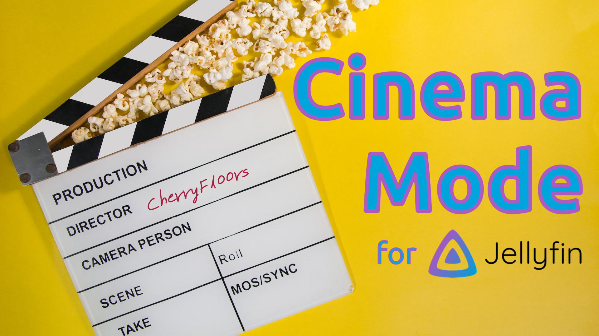

<h1 align="center">Jellyfin Cinema Mode Plugin</h1>
<h3 align="center">Plugin for the <a href="https://jellyfin.org">Jellyfin Project</a></h3>

<p align="center">

</p>

Photo by <a href="https://unsplash.com/@grstocks?utm_source=unsplash&utm_medium=referral&utm_content=creditCopyText">GR Stocks</a> on <a href="https://unsplash.com/photos/q8P8YoR6erg?utm_source=unsplash&utm_medium=referral&utm_content=creditCopyText">Unsplash</a>
  
## About

Jellyfin Cinema Mode is a plugin built with .NET that allows users to enable Jellyfin's Cinema Mode functionality with local trailers and pre-rolls. The system admin can configure a set number of trailers to play before a movie. In addition, pre-roll videos can be played before and after the block of trailers. All of this can be disabled at the user level by turning off Cinema Mode in the users Playback settings. Pro tip: Skip any pre-roll or trailer by pressing the next button in the player. For more details see the [User Guide](#user-guide)

## Installation

To install this plugin, you will first need to add the repository in Jellyfin. Under 'Repositories' in the 'Plugin' section of the dashboard, click the plus sign to add a new repository. You can give this repository any name you like but be sure to paste the following URL in the 'Repository URL' field exactly as it appears:

```
https://raw.githubusercontent.com/CherryFloors/jellyfin-plugin-cinemamode/main/manifest.json
```

Now that you have added the repository, click on the Catalog section at the top of the screen. Under General, you should see the Cinema Mode plugin. Click on the thumbnail and then click the install button. Restart the server and you're ready to configure.

More information about installing plugins can be found in the official docs [here](https://jellyfin.org/docs/general/server/plugins/index.html#installing). A quick web search will also turn up plenty of great tutorial videos for setting up Jellyfin, including how to install 3rd party plugins.

## User Guide

The plugin is designed to work with **local** content and provide a minimalist approach to configuration at the moment. Open the plugin's configuration page by clicking on the thumbnail under 'My Plugins'.

### ~~Pre-Rolls~~

~~Jellyfin does not manage this type of content out of the box so the plugin creates a 'Pre-Roll' channel to organize them. A channel was chosen primarily for its ability to be hidden from non-admin users. The channel has two sub folders, 'Trailer Pre-Rolls' and 'Feature Pre-Rolls'. 'Trailer Pre-Rolls' are videos meant to play prior to a block of trailers (think "Now playing on Jellyfin..."). 'Feature Pre-Rolls' are videos meant to play prior to the feature presentation (think "Now your feature presentation..."). Media locations for these folders are controlled in the plugins configuration page.~~

~~Some important points about Pre-Rolls:~~
1. ~~All content in the channel is given the same rating so don't add content not suitable for all users.~~
2. ~~A scheduled task refreshes the Pre-Roll channel once per day. If you add/remove items or change the channel paths and want the changes reflected immediately, open each channel folder. This will trigger a refresh of channel contents, otherwise it will update within 24 hours.~~
3. ~~The folder containing your pre-rolls should contain only valid video files. The plugin will ignore any subdirectories and videos in them.~~

### Trailers

The plugin will automatically find any trailers you have in your Jellyfin library. Just configure the number of trailers you want to play in the plugins configuration page and you’re good to go. 

By default, "Enforce Rating Limit" is enabled. This ensures the rating of the trailer content does not exceed that of the feature (i.e. trailers for an "R" rated movie will not be shown before a "PG-13" movie). This setting will cause any unrated content to have no trailers played prior and not be shown as a trailer. In this case "unrated" refers to content where the "Parental Rating" field is blank. It does not refer to content with an "NR" or "Not Rated" rating. Jellyfin considers content with a rating of "NR" as exceeding an "R" rating.

 The plugin does not support playback of remote trailers. For information on how to add local trailers to Jellyfin, follow [this guide](https://jellyfin.org/docs/general/server/media/movies/#movie-extras). 

### Troubleshooting

If the plugin is not providing intros check the following:
- "Cinema Mode" is enabeled in your users playback settings.
- You have some trailers stored alongside your media following the naming conventions given [here](https://jellyfin.org/docs/general/server/media/movies/#movie-extras).
- You can playback videos in the 'Trailer Pre-Rolls' and 'Feature Pre-Rolls' sub folders of the ‘Pre-Roll’ channel. Opening these folder will trigger a refresh that may fix your issue.
- The Jellyfin service has at least read access to the directories containing your pre-rolls.

## Build Process

1. Clone or download this repository

2. Ensure you have .NET Core SDK setup and installed

3. Build plugin with following command

```sh
dotnet publish --configuration Release --output bin
```

4. Place the resulting file in the `plugins` folder

